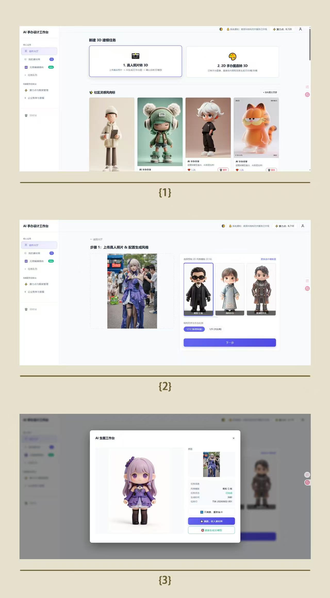
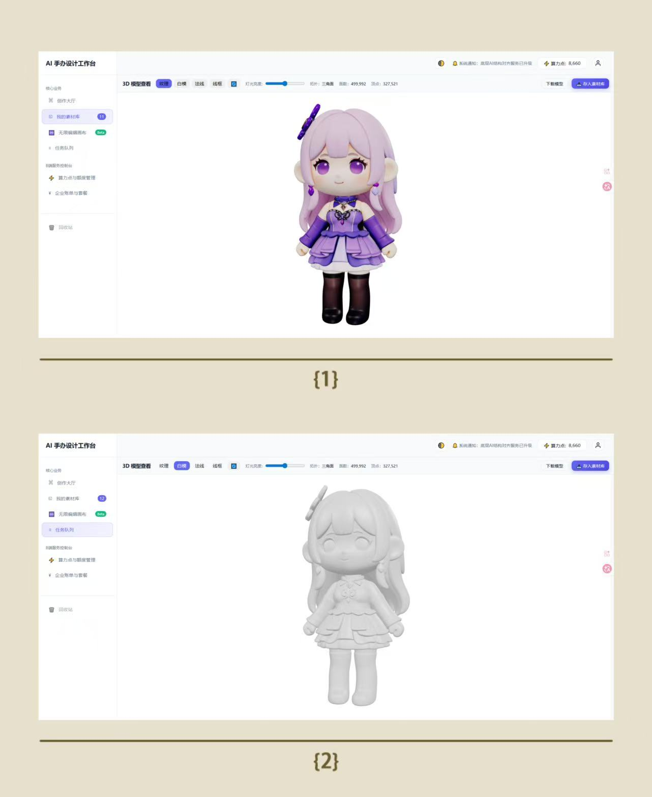
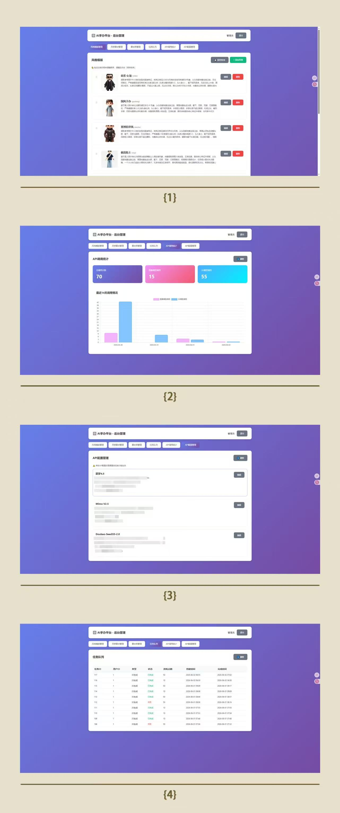

# 🎨 AI 手办多模态设计平台 | AI Figure Multimodal Design Platform

> **让每个人都能设计自己的 3D 手办**
>
> **Everyone can design their own 3D figure.**

> An AI-powered platform that transforms your ideas into 3D figures through multimodal generation.
>
> 一个基于 AI 的多模态生成平台，将你的创意转化为 3D 手办模型。

[](https://opensource.org/licenses/MIT)
[](https://www.python.org/)
[](https://flask.palletsprojects.com/)

---

## ✨ 项目亮点 | Highlights

🎯 **一站式设计流程 | All-in-One Workflow** — 从灵感素材到 2D 图像再到 3D 模型，完整创作链路 / From inspiration to 2D image to 3D model, a complete creative pipeline

🎨 **多风格支持 | Multi-Style Support** — Q版手办、写实、赛博朋克、水墨等多种风格模板 / Chibi, realistic, cyberpunk, ink-wash and more style templates

🎲 **智能抽卡 | Smart Reroll** — 不满意可重新生成，满意即可收入素材库 / Regenerate if unsatisfied, save to library when happy

🔄 **2D → 3D 重建 | 2D → 3D Reconstruction** — 基于 Doubao-Seed3D-2.0，自动将 2D 图像转为 3D 模型 / Powered by Doubao-Seed3D-2.0, automatic 2D-to-3D conversion

👁️ **实时 3D 预览 | Real-time 3D Preview** — Three.js 渲染，支持旋转、缩放、多角度查看 / Three.js rendering with rotation, zoom, and multi-angle viewing

---

## 🎬 演示 | Demo

<!-- 请将截图放在 static/images/ 目录下，并替换以下链接 -->
<!-- Place screenshots in static/images/ and replace the links below -->

| 功能 Feature | 预览 Preview |
|------|------|
| 2D 图像生成 2D Generation |  |
| 3D 模型预览 3D Preview |  |
| 后台管理 Admin Panel |  |

> 💡 **提示 Tip**：运行项目后访问 http://127.0.0.1:5000 体验完整功能 / Visit after running the project to experience all features

---

## 🚀 快速开始 | Quick Start

### 环境要求 | Prerequisites

- Python 3.8+
- 火山引擎 API Key（用于 AI 生成服务）/ Volcengine API Key (for AI generation services)

### 安装步骤 | Installation

```bash
# 1. 克隆仓库 | Clone the repository
git clone https://github.com/Jasonlieee/AI_3D_Platform_Demo.git
cd AI_3D_Platform_Demo

# 2. 安装依赖 | Install dependencies
pip install -r requirements.txt

# 3. 启动服务 | Start the server
python app.py
```

### 配置 API Key | Configure API Keys

首次启动后，访问后台管理页面 http://127.0.0.1:5000/admin 配置：
After first launch, visit the admin panel to configure:

| API | 用途 Purpose | 获取方式 How to Get |
|-----|------|----------|
| 即梦 4.5 / Seedream 4.5 | 2D 图像生成 / 2D Generation | [火山引擎控制台 Volcengine Console](https://console.volcengine.com/) |
| Doubao-Seed3D | 3D 模型重建 / 3D Reconstruction | [火山引擎控制台 Volcengine Console](https://console.volcengine.com/) |
| Mimo V2.5 | AI 助手对话 / AI Chat | [火山引擎控制台 Volcengine Console](https://console.volcengine.com/) |

### 默认账号 | Default Account

| 角色 Role | 用户名 Username | 密码 Password |
|------|--------|------|
| 管理员 Admin | `admin` | `admin123` |

---

## 📖 功能详解 | Features

### 🎨 2D 图像生成 | 2D Image Generation

将灵感素材转化为精美的 2D 图像：
Transform inspiration materials into stunning 2D images:

1. **选择灵感素材** — 从素材库上传或选择灵感图片 / Upload or select inspiration images from the library
2. **选择风格模板** — Q版手办、写实、赛博朋克、水墨等 / Choose from chibi, realistic, cyberpunk, ink-wash styles
3. **AI 生成** — 调用即梦 4.5 API 生成图像 / Generate images via Seedream 4.5 API
4. **抽卡机制** — 不满意可重新生成，满意可收入素材库 / Reroll if unsatisfied, save to library when happy

### 🧊 3D 模型重建 | 3D Model Reconstruction

将 2D 图像转化为可交互的 3D 模型：
Convert 2D images into interactive 3D models:

1. **选择 2D 图像** — 从素材库或生成结果中选择 / Select from library or generation results
2. **AI 重建** — 调用 Doubao-Seed3D-2.0 进行 3D 重建 / Reconstruct via Doubao-Seed3D-2.0
3. **自动预处理** — 格式转换、尺寸缩放、压缩优化 / Auto preprocessing: format conversion, resizing, compression
4. **实时预览** — Three.js 渲染，支持 GLB/OBJ 格式 / Three.js rendering, supports GLB/OBJ formats

### 📁 素材库管理 | Asset Library

- ✅ 收藏 / 删除 / 恢复 — Favorite / Delete / Restore
- ✅ 批量操作（批量删除、批量下载）— Batch operations (batch delete, batch download)
- ✅ 回收站机制 — Recycle bin mechanism
- ✅ 智能标签识别 — Smart tag identification (3D/2D/OBJ/GLB/AI)
- ✅ 3D 模型实时预览 — Real-time 3D model preview

### ⚙️ 后台管理 | Admin Panel

- 🎨 风格模板管理（CRUD + 拖拽排序）/ Style template management (CRUD + drag-and-drop sorting)
- 🖼️ 灵感素材管理 / Inspiration material management
- 🔑 API 配置管理 / API configuration management
- 📊 数据统计 / Data statistics

---

## 🏗️ 技术架构 | Architecture

### 技术栈 | Tech Stack

| 层级 Layer | 技术 Technology | 说明 Description |
|------|------|------|
| **后端 Backend** | Flask + SQLite | RESTful API，轻量级数据库 / Lightweight database |
| **前端 Frontend** | HTML/CSS/JS + Three.js | 原生实现，3D 渲染引擎 / Vanilla implementation, 3D rendering engine |
| **AI 服务 AI Service** | 火山引擎 Doubao 系列 / Volcengine Doubao | 2D 生成 + 3D 重建 + 对话 / 2D gen + 3D recon + chat |

### 系统架构 | System Architecture

```
┌─────────────────────────────────────────────────────────────┐
│                   用户界面层 UI Layer                        │
│  ┌──────────────────┐  ┌──────────────────┐                 │
│  │   index.html     │  │   admin.html     │                 │
│  │   (前端主页面)    │  │   (后台管理)      │                 │
│  │   (Main Frontend)│  │   (Admin Panel)  │                 │
│  └──────────────────┘  └──────────────────┘                 │
└─────────────────────────────────────────────────────────────┘
                              │
                              ▼
┌─────────────────────────────────────────────────────────────┐
│               Flask 后端服务 Backend Service                 │
│  ┌─────────────┐ ┌─────────────┐ ┌─────────────┐           │
│  │  认证模块    │ │  生成模块    │ │  管理模块    │           │
│  │   Auth      │ │  Generate   │ │   Admin     │           │
│  └─────────────┘ └─────────────┘ └─────────────┘           │
└─────────────────────────────────────────────────────────────┘
                              │
                              ▼
┌─────────────────────────────────────────────────────────────┐
│              外部 AI 服务 External AI Services               │
│  ┌─────────────┐ ┌─────────────┐ ┌─────────────┐           │
│  │  即梦 4.5   │ │  Seed3D     │ │  Mimo V2.5  │           │
│  │ Seedream4.5 │ │  (3D重建)   │ │  (AI Chat)  │           │
│  │  (2D Gen)   │ │  (3D Recon) │ │  (AI对话)   │           │
│  └─────────────┘ └─────────────┘ └─────────────┘           │
└─────────────────────────────────────────────────────────────┘
```

### 关键技术点 | Key Technical Points

- **图片预处理流水线 / Image Preprocessing Pipeline** — RGBA→RGB 转换、超大图片缩放、JPEG 压缩优化 / RGBA→RGB conversion, large image downscaling, JPEG compression optimization
- **任务队列管理 / Task Queue Management** — 异步轮询、状态管理、失败重试机制 / Async polling, state management, failure retry mechanism
- **算力点系统 / Compute Points System** — 用户资源管理、失败自动退还 / User resource management, auto-refund on failure
- **3D 渲染优化 / 3D Rendering Optimization** — 磨砂材质、三层光效、ACES 色调映射 / Matte material, three-point lighting, ACES tone mapping

---

## 📡 API 设计 | API Design

### 第三方 AI API | Third-Party AI APIs

| API | 模型 Model | 用途 Purpose |
|-----|------|------|
| 火山引擎 Doubao-Seedream-4.5 | doubao-seedream-4-5-251128 | 2D 图像风格化生成 / 2D image stylized generation |
| 火山引擎 Doubao-Seed3D-2.0 | doubao-seed3d-2-0-260328 | 2D → 3D 模型重建 / 2D → 3D model reconstruction |
| 火山引擎 Mimo V2.5 | mimo-v2.5 | AI Agent 对话 / AI Agent chat |

### 项目 API 端点 | Project API Endpoints

项目提供了完整的 RESTful API，涵盖以下模块：
The project provides a complete RESTful API covering the following modules:

| 模块 Module | 端点数 Endpoints | 说明 Description |
|------|--------|------|
| 认证 Auth | 3 | 登录、注册、用户信息 / Login, register, user info |
| 灵感素材 Inspirations | 3 | 增删查 / CRUD |
| 风格模板 Styles | 3 | 增删查 + 排序 / CRUD + sorting |
| 素材库 Library | 6 | CRUD + 批量操作 / CRUD + batch ops |
| 回收站 Recycle Bin | 3 | 查看、删除、清空 / View, delete, clear |
| 生成 Generation | 2 | 2D 生成、3D 生成 / 2D gen, 3D gen |
| 任务 Tasks | 3 | 查询、删除 / Query, delete |
| 算力点 Points | 2 | 查询、扣除 / Query, deduct |
| API Key | 3 | 管理 / Management |
| 后台管理 Admin | 12 | 完整管理功能 / Full admin features |

> 📚 完整 API 文档请访问 http://127.0.0.1:5000 查看
>
> 📚 For complete API documentation, visit http://127.0.0.1:5000

---

## 📋 项目结构 | Project Structure

```
AI_3D_Platform_Demo/
├── app.py                      # Flask 后端主文件（1,900+ 行）
│                               # Main Flask backend (1,900+ lines)
├── static/
│   ├── index.html              # 前端主页面（3,800+ 行）
│   │                           # Main frontend page (3,800+ lines)
│   ├── admin.html              # 后台管理页面（1,300+ 行）
│   │                           # Admin panel (1,300+ lines)
│   ├── images/                 # 静态图片资源 / Static image assets
│   └── uploads/                # 用户上传文件 / User uploads
│       ├── inspirations/       # 灵感素材 / Inspiration materials
│       ├── library/            # 素材库图片 / Library images
│       ├── models/             # 3D 模型文件 / 3D model files
│       ├── previews/           # 模型预览图 / Model preview images
│       └── styles/             # 风格模板图片 / Style template images
├── requirements.txt            # Python 依赖 / Python dependencies
├── README.md                   # 项目说明 / Project documentation
└── V1_RELEASE.md               # v1 结项文档 / v1 release notes
```

---

## 🔮 未来规划 | Roadmap

### v1.1 — 无限画布 | Infinite Canvas

- 🖼️ 画布缩放 / 平移 — Canvas zoom / pan
- 🔗 节点连线 — Node connections
- 🎨 多素材组合编排 — Multi-asset composition
- 📐 自由布局设计 — Free layout design

---

## 🤝 贡献 | Contributing

欢迎贡献代码、报告问题或提出建议！
Contributions, issues, and feature requests are welcome!

1. Fork 本仓库 / Fork the repository
2. 创建特性分支 / Create a feature branch (`git checkout -b feature/AmazingFeature`)
3. 提交更改 / Commit your changes (`git commit -m 'Add some AmazingFeature'`)
4. 推送到分支 / Push to the branch (`git push origin feature/AmazingFeature`)
5. 创建 Pull Request / Open a Pull Request

---

## 📄 许可证 | License

本项目基于 MIT License 开源。
This project is licensed under the MIT License.

---

## 👤 作者 | Author

**Jasonlieee**

- GitHub: [@Jasonlieee](https://github.com/Jasonlieee)

---

> 🌟 如果这个项目对您有帮助，请给个 Star 支持一下！
>
> 🌟 If you find this project helpful, please give it a Star!
